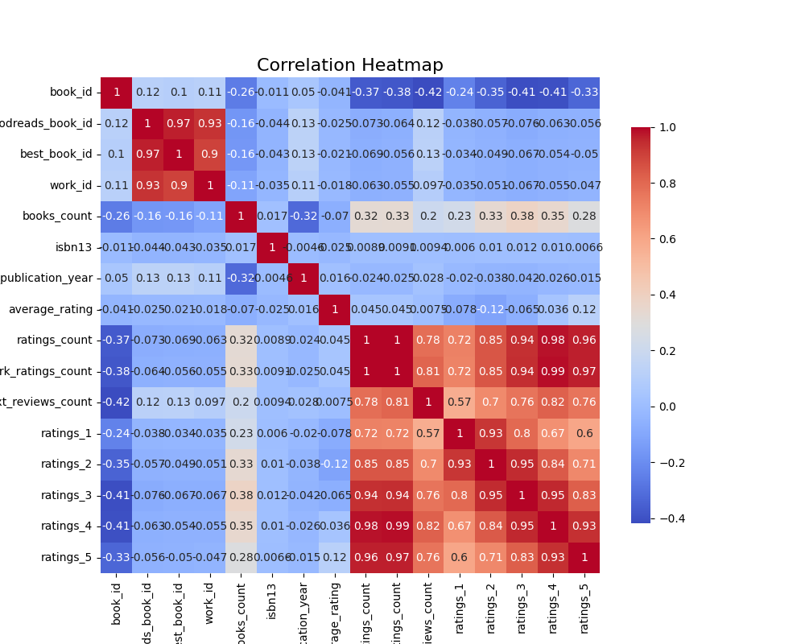
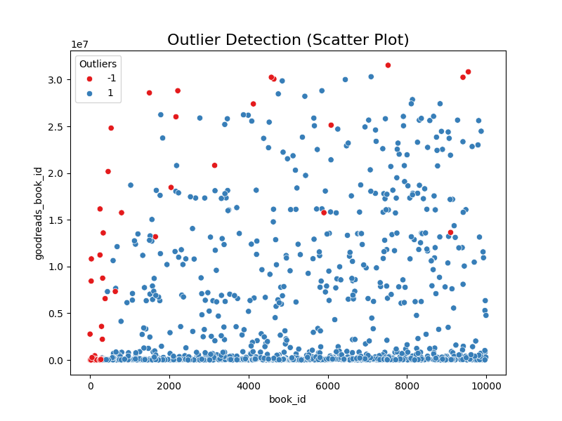
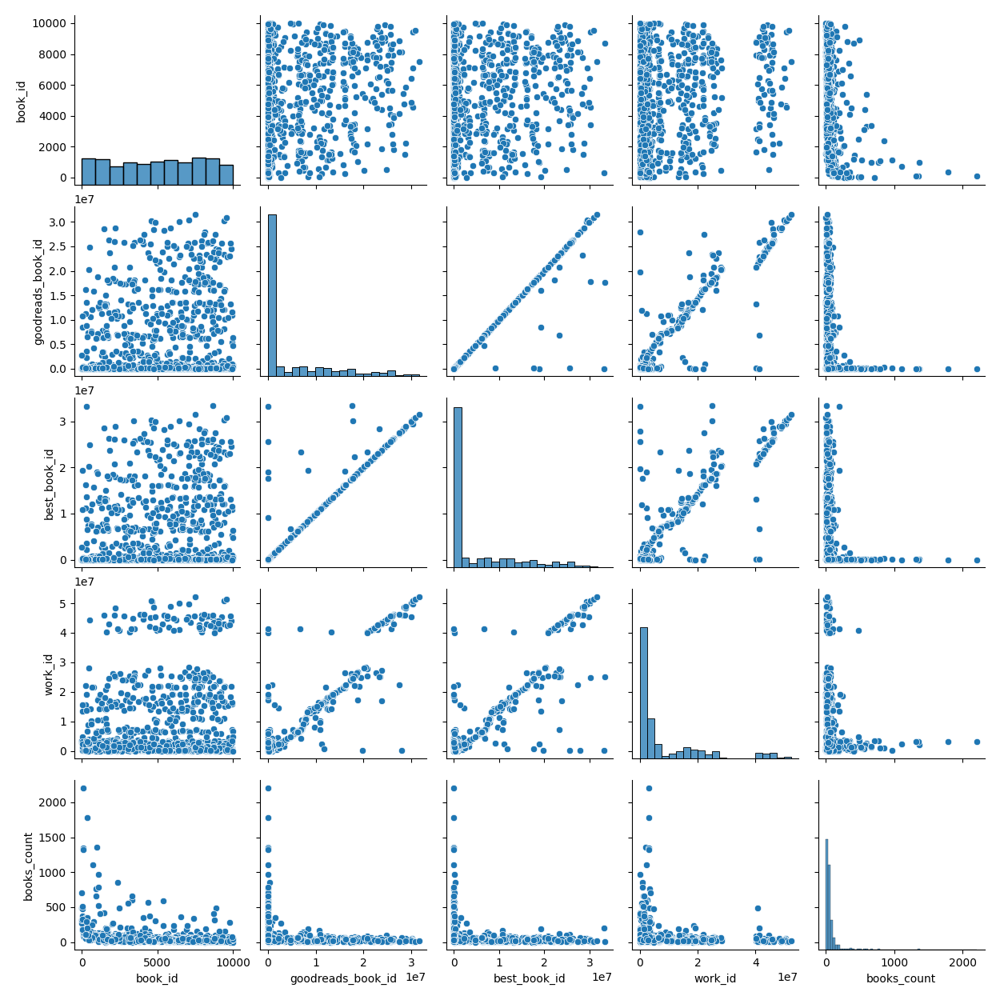

# Goodreads Book Data Analysis Report

This report presents the analysis of a Goodreads book dataset containing 10,000 entries and 23 features.  The analysis focuses on descriptive statistics, correlation analysis, and cluster analysis, visualized through various plots.

## 1. Data Properties

The dataset comprises information on various books, including their identifiers (book_id, goodreads_book_id, best_book_id, work_id), publication details (original_publication_year, original_title, title, language_code), author information (authors), ISBNs (isbn, isbn13), rating statistics (average_rating, ratings_count, work_ratings_count, work_text_reviews_count, ratings_1, ratings_2, ratings_3, ratings_4, ratings_5), and image URLs (image_url, small_image_url).

**Key Data Characteristics:**

* **Shape:** (10000, 23)
* **Missing Values:**  Significant missing values exist in 'isbn' (700), 'isbn13' (585), 'original_publication_year' (21), 'original_title' (585), and 'language_code' (1084).  These will need to be addressed during preprocessing for certain analyses.
* **Data Types:**  The dataset includes a mix of numerical (integers and floats) and categorical (object) variables.

## 2. Descriptive Statistics

Descriptive statistics provide a summary of the central tendency and dispersion of the numerical features. Key findings include:

* **Average Rating:** The average rating is 4.00, indicating generally positive reviews.
* **Rating Distribution:** The rating counts (ratings_1 to ratings_5) show a right-skewed distribution, suggesting a higher concentration of books with higher ratings.
* **Publication Year:**  The average original publication year is approximately 1982, with a significant range spanning multiple centuries.  Note that this distribution is heavily skewed, possibly due to outliers and negative values. 
* **High Variance in Ratings:**  Features like `ratings_count`, `work_ratings_count`, and the individual rating counts (`ratings_1` to `ratings_5`) show high variance indicating a wide range of popularity among the books.

## 3. Correlation Analysis

Correlation analysis reveals the relationships between variables.  A significant positive correlation (>= 0.8) exists between several rating-related variables:

* **Strong Positive Correlation:** `ratings_count` and `work_ratings_count` show almost perfect positive correlation (0.995), indicating that the total number of ratings strongly reflects the total number of work ratings.  Similarly, strong correlations exist between `ratings_count` and other rating categories (`ratings_4`, `ratings_5`, `ratings_3`).
* **Moderate to Strong Positive Correlation:**   Several rating categories are also strongly correlated with each other,  suggesting that the distribution of ratings across different rating levels are interconnected.  
* **Moderate Correlation:** `work_text_reviews_count` correlates moderately with overall rating counts and rating categories (`ratings_4`, `ratings_5`), suggesting a connection between the number of reviews and positive ratings.

**(Visualisation: correlation_heatmap.png)**  _This visualization would show a heatmap clearly depicting the correlation matrix, highlighting the relationships described above._

## 4. Cluster Analysis (K-Means)

K-means clustering with two clusters identified three main groups: one large cluster (9967 books) and two smaller ones (24 and 9 books). This suggests a possible grouping of books based on their rating characteristics.  Further investigation is needed to understand the defining characteristics of each cluster.

**(Visualisation:  pairplot_analysis.png)** _This visualization would present a pairplot showing the relationship between key numerical features in the different clusters._

**(Visualisation: outlier_detection.png)** _This visualization would show scatter plots or boxplots to indicate outliers for key variables, supporting the high-variance observations mentioned in Section 2._

## 5. Outlier Detection

The high variance and skewness in several variables, especially in rating counts and publication years, suggest the presence of outliers.  Further analysis using techniques like z-scores or IQR would be necessary to identify and potentially treat these outliers depending on the research goals.

## 6. Implications and Further Work

The analysis reveals strong relationships between various rating metrics, indicating that book popularity is consistently reflected across different rating dimensions. The presence of outliers, particularly in rating counts, might indicate very popular books or data entry errors that warrant further investigation.  Missing values need to be handled appropriately through imputation or removal before conducting more advanced analyses.

Further analysis could include:

* **Missing Data Imputation:**  Employing appropriate techniques to handle missing data in 'isbn', 'isbn13', 'original_publication_year', 'original_title', and 'language_code'.
* **Outlier Treatment:** Identifying and dealing with outliers in rating counts and publication years.
* **Advanced Clustering:** Exploring other clustering techniques or dimensionality reduction methods for more insightful cluster analysis.
* **Regression Modeling:** Building predictive models to predict average ratings or rating counts based on other features.
* **Text Analysis (authors, titles, original_titles):**  Analyzing the text data to identify trends in author popularity, genre, or topic.

This report provides a preliminary analysis.  Further investigation and more sophisticated techniques can uncover deeper insights from this dataset.

